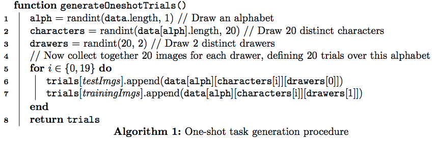

# SiameseNetworks-for-one-shot-Image-recognition

This is the implementation of Paper Siamese Neetworks for One-shot Image recognition in pytorch

## Important points from the Paper
1. A Siamese neural network consists of twin networks that accept distinct inputs and computes some metrics between the highest level feature representation on each side
2. The parameters between the twin networks are tied. Weight tying guarantees that two extremely similar images could not possibly be mapped by their respective networks to very different locations in feature space because each network computes the same function
3. The network is symmetric, so that whenever two distinct images are presented to the twin networks, the top conjoining layer will compute the same metric as if we were to present the same two images but to the opposite twins.

## Two steps for one-shot classification
### Verification task : 
A neural network is trained to discriminate between the class-identity of image pairs. verification model learns to identify input pairs according to the probability that they belong to the same class or different classes.
### Classification task : 
The trained model can then be used to evaluate new images, exactly one per novel class, in a pairwise manner against the test image. The pairing with the highest score according to the verification network is then awarded the highest probability for the one-shot task

## Training strategy:
1. 30 alphabets out of 50 and 12 drawers out of 20 are used for training. 
2. Added eight transforms for each training example
## Validation strategies:
1. 10,000 example pairs taken from 10 alphabets and 4 additional drawers( validation data)
2. 320 one-shot recognition trials are generated for the validation set which mimics the target task on the evaluation set.

## One-shot performance:
### Generating one shot trials

#### Omniglot dataset

1. Once trials have been generated, iterate through each image in trials[testImgs] and compare against the twenty images in trials[trainingImgs] to perform twenty one-shot trials. This can be repeated for as many alphabets as desired.
2. This process is repeated twice for all alphabets so that there are 40 one-shot learning trials for each of the ten evaluation alphabets. This constitutes a total of 400 one-shot learning trials, from which the classification accuracy is calculated.

#### MNIST dataset
A similar procedure is applied on MNIST, generating 400 one-shot trials on the MNIST test set, but excluding any fine-tuning on the training set. All 28×28 images were upsampled to 35×35, then given to a reduced version of our model trained on 35×35 images from Omniglot which were downsampled by a factor of 3.

## Important things to note before seeing the code
In One-shot dataloader I have used batch-size of 1 as my code will be return two lists of images in single iteration. Each image in single list is compared with all the images in other list.
A one shot trial is comparing an image of one character with all the other characters in the second list(The characters in second list may or may not be from same alphabet)

## Hierachy of Omniglot Dataset
### images_Background ---> Alphabets ---> Characters ---> Images of various drawers

# PS I did not train as I my PC do not have enough capability to run this.
If you have any doubts contact me : vikramreddy0307@gmial.com
                                      
